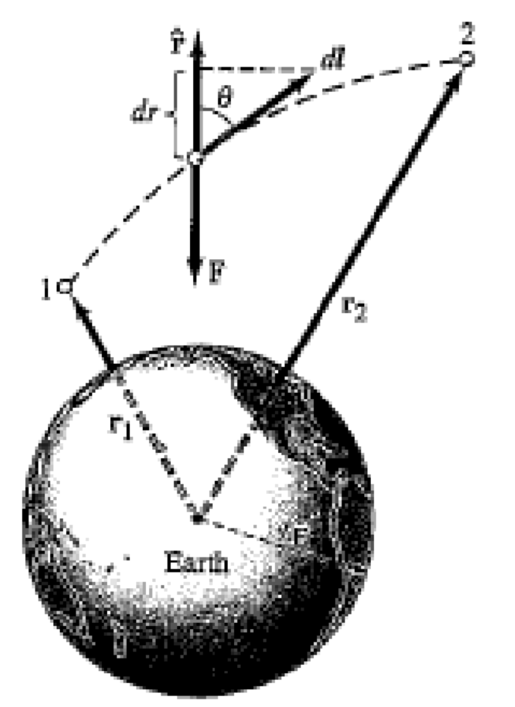

Tags: #Formula

# Gravitational Potential Energy

**Gravitational Potential Energy** ($U_g$ : Scalar | $J$) - The potential energy of an object due to the gravitational force acting on it.

Gravitational potential energy can only exist if there are two or more objects present.

When an object is infinitely far away from another object, the gravitational potential energy of the system of both objects is $0$.

## Work

In relation to work, the negative change in gravitational energy is the work done by the field. This is because if the $U_g$ decreases, which results in a negative $\Delta U_g$, then the gravitational force did work to bring the two objects together, which lowers their $U_g$.

$$\Huge W_\text{grav} = -\Delta U_g$$
$$\Huge W_\text{ext} = \Delta U_g$$

## Equation

The equation for gravitational potential energy is

$$\Huge U_g = -\frac{GmM}{r}$$

> **LEGEND:**
> $U_g$ - Gravitational potential energy between two objects.
> $G$ - Gravitational constant, which is around $6.667 \times 10^{-11} \frac{m^3}{kg \cdot s^2}$.
> $m$ - Mass of one object.
> $M$ - Mass of the other object.
> $r$ - Distance between the center of mass of the two objects.
> $-$ - Negative sign indicates that when the masses are farther apart, they have a higher $U_g$ ($U_g$ is closer to $0$), and that when the masses are close together, they have a lower $U_g$ ($U_g$ is farther away from $0$ in the negative direction)

If an object with small mass is close to a massive body's surface, then the equation can be simplified down to,

$$\Huge U_g = mgh$$

> **LEGEND**
> $U_g$ - Gravitational potential energy of the small object.
> $m$ - Mass of the small object.
> $g$ - Gravitational acceleration due to the large object.
> $h$ - The height at which the small object is placed relative to some position.

> **NOTE:**
> You can choose any position as $h=0$ but you must use that chosen posiiton as $h=0$ for all calculations of $U_g$.

## Derivation

The first gravitational potential energy equation is derived from the work equation with gravitational force plugged in. Since we are dealing with vectors, we use a unit vector $\hat r$ pointing away from one object.

$$
\Large
\begin{aligned}
\Delta U_g = W &= \int_{r_1}^{r_2} F_g \cdot dl \\
&= \int_{r_1}^{r_2} -\frac{GmM}{r^2} \vec{\hat r} \cdot dl\\
\end{aligned}
$$