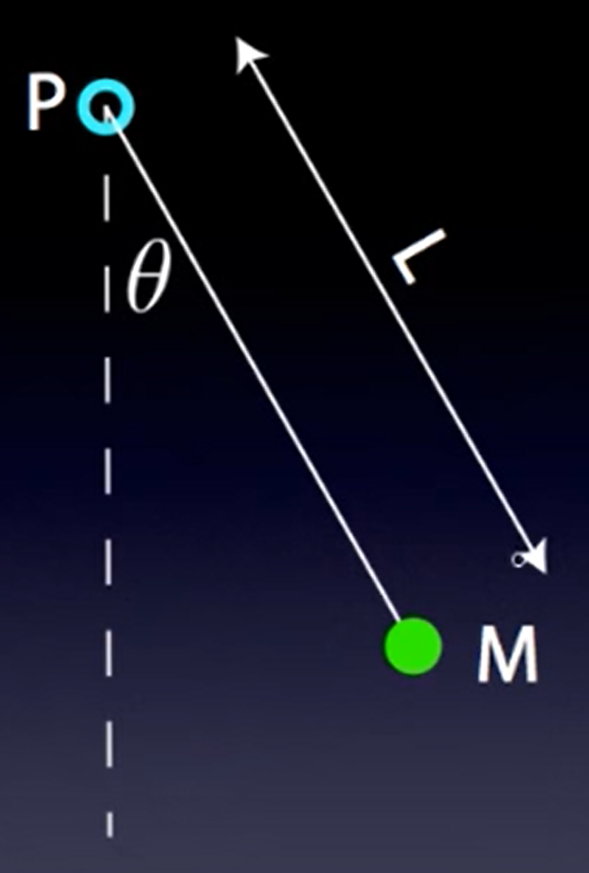

Tags: #Topic

# Pendulums

## Simple Pendulum

### Derivation

According to [[Simple Harmonic Motion]], we must prove that

$$\Large a = \omega^2x$$

Since the acceleration, $a$, of the SHM particle must be in the direction of displacement, $a$ for the pendulum is equal to the tangential acceleration $a_\text{}$ of the mass, since this points in the direction of the displacement of the mass. And for the sake of clarity, we will use $s$ instead of $x$ for displacement. Therefore,

$$\Large a_\text{tang} = \omega^2s$$

Using some geometry, we know that 

$$
\Large 
\begin{aligned}
F_\text{tang} = F_g \sin\theta &= ma_\text{tang} \\
 mg \sin\theta &= ma_\text{tang} \\
 g \sin\theta &= a_\text{tang} \\
\end{aligned}
$$

Plugging back into the SHM equation,

$$\Large g \sin\theta = \omega^2x$$

Since $\theta \approx \sin\theta$ for small angles of $\theta$, then

$$\Large g \theta = \omega^2x$$

Since the displacement is an arc length,

$$
\Large
\begin{aligned}
\theta L &= s \\
\theta &= \frac{s}{L} \\
\end{aligned}
$$

Therefore,

$$
\Large
\begin{aligned}
g \left( \frac{s}{L} \right) &= \omega^2s \\
\frac{g}{L} &= \omega^2 \\
\omega &= \sqrt{\frac{g}{L}}\\
\end{aligned}
$$

This means,

$$
\Large
\begin{aligned}
T = 2\pi \sqrt{\frac{L}{g}}
\end{aligned}
$$

> #Question
> How does Dan Fullerton's derivation for a simple pendulum work?
> Specifically, why does he have a negative for $-M_gL\theta = I_p \alpha$?
> If $I_p \alpha$ is from the definition of the torque $\tau_p$, then shouldn't it be equal to  $-M_gL\theta$, since that also is equal to the torque $\tau_p$ (See the start of the derivation).
> https://www.youtube.com/watch?v=gk4KrcKIQ50

## Physical Pendulum

### Derivation

$$\Large \tau_\text{net} = $$

Temporarily stopped since this derivation depends on Dan Fullerton's previous derivation.