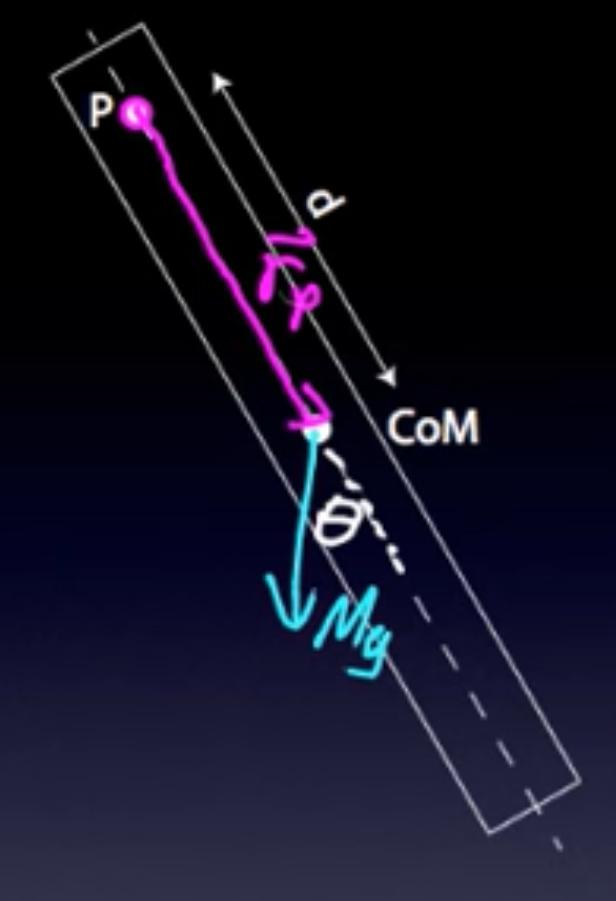

Tags: #Topic 

# Physical Pendulum

Physical pendulums do not have their mass concrentrated at a point. Instead, they have a center of mass that rotates around a pivot.

$$\Large \omega = \sqrt{\frac{mgd}{I_p}}$$

The period $T$ depends on $\omega$, which depends on the the moment of inertia, $I_p$, of the rotating mass.

## Derivation via Torque

Using part of the torque derivation from a [[Simple Pendulum]], we know that

$$\Large \omega = \sqrt{\frac{mgd}{I_p}}$$