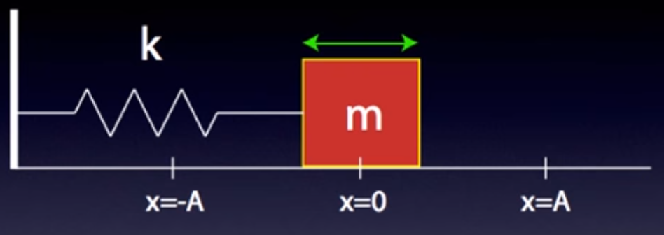
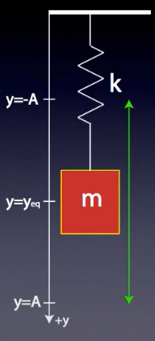

Tags #Topic

# Spring Mass Oscillators

## Horizontal Spring Oscillator

### Derivation

Using Hooke's Law (under [[Springs]]),

$$\Large F_s = ma = -kx$$

We can rewrite $a$ as,

$$\Large a = \frac{d^2x}{dt^2} $$

Therefore,

$$\Large F_s = m \cdot \frac{d^2x}{dt^2} = -kx$$
$$\Large F_s = \frac{d^2x}{dt^2} = -\frac{kx}{m}$$
$$\Large \frac{d^2x}{dt^2} + \frac{kx}{m} = 0$$

The only function that satisfies this equation is either $\sin$ or $\cos$, therefore this uses the simple harmonic equation.

$\omega^2$ is equal to the coefficient of the $x$, therefore

$$
\Large
\begin{aligned}
\omega &= \sqrt{\frac{k}{m}} \\
T &= 2\pi \sqrt{\frac{m}{k}} \\
x(t) &= A\cos \left( \left( 2\pi \sqrt{\frac{m}{k}} \right) t + \phi \right) \\
\end{aligned}
$$

## Vertical Spring Oscillator

### Derivation

At rest, the spring will reach an equilibrium, $y_eq$, after the force of gravity pulling down on the mass matches the magnitude of the springe force pulling up on the mass.

$$
\Large
\begin{aligned}
F_\text{net} &= F_s - F_g = 0 \\
&= ky_\text{eq} - mg = 0 \\
\end{aligned}
$$

$$
\Large
\begin{aligned}
ky_\text{eq} &= mg \\
y_\text{eq} &= \frac{mg}{k} \\
\end{aligned}
$$

If we pull the mass some distance $A$ away from this equilibrium, then

$$
\Large
\begin{aligned}
F_\text{net} &= F_s - F_g \\
&= ky_\text{new} - mg \\
&= k(y_\text{eq} + A) - mg \\
&= ky_\text{eq} + kA - mg \\
&= (ky_\text{eq} - mg) + kA \\
&= 0 + kA \\
&= kA \\
\end{aligned}
$$

Therefore vertical spring oscillators behave identically to horizontal spring oscillators except for the fact that 

$$\Large y_\text{eq} = \frac{mg}{k}$$