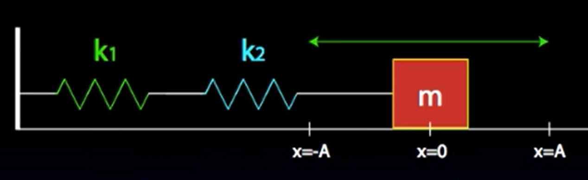
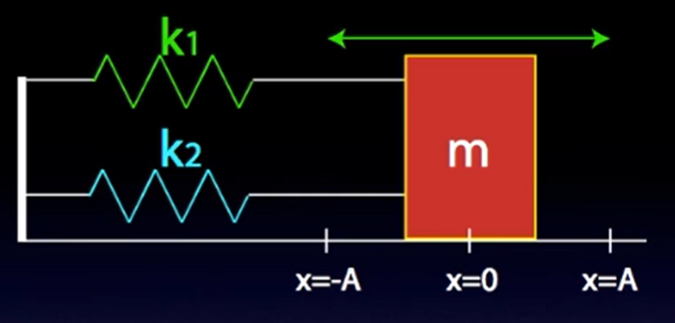

Tags: #Topic 

# Springs

Springs are coils of a material that can stretch and shrink but always wants to return to it's original position.

The more you stretch or compress a spring, the greater the force exerted by the spring.

**Equilibrium Position** - The original position that a spring wants to return to

## [[Hooke's Law]]
## [[Spring Potential Energy]]

## Springs in Series and Parallel

Similar to circuits, springs can be "simplified" into an equivalent spring that behaves exactly the same as the ends of a group of connected springs.

### Series

$$\Large k_\text{eq} = \left( \frac{1}{k_1} + \frac{1}{k_2} + \frac{1}{k_3} + \ldots \right)^{-1}$$

**Springs in series are like capacitors in series.**

#### Derivation

Assume the system is at rest.

If we analyze the line connecting the two springs, then

$$\Large F_\text{net} = F_2 - F_1 = 0$$
$$
\Large
\begin{aligned}
F_1 &= F_2 \\
k_1 x_1 &= k_2 x_2 \\
x_1 &= \frac{k_2}{k_1} x_2 \\
\end{aligned}
$$

The total displacement is the sum of the individual displacement of each spring.

$$\Large x_{eq} = x_1 + x_2$$

We assume there is some equivalent spring that can model the behavior of the force exerted on the mass by the final spring.

$$\Large
\begin{aligned}
F_\text{eq} &= k_\text{eq}x_{eq} \\
&= k_\text{eq} (x_1 + x_2) \\
&= k_\text{eq} \left( \frac{k_2}{k_1} x_2 + x_2 \right) \\
&= k_\text{eq} x_2 \left( \frac{k_2}{k_1} + 1 \right) \\
\end{aligned}
$$

We also know that $F_\text{eq}$ is also just the spring force of the final spring that is connected to the block.

$$\Large F_\text{eq} = k_2 x_2 = k_\text{eq}$$

Therefore,

$$
\Large
\begin{aligned}
k_2 x_2 &= k_\text{eq} x_2 \left( \frac{k_2}{k_1} + 1 \right) \\
k_2 &= k_\text{eq} \left( \frac{k_2}{k_1} + 1 \right) \\
\frac{1}{k_2} &= \frac{1}{k_\text{eq} \left( \frac{k_2}{k_1} + 1 \right)} \\
\end{aligned}
$$

$$
\Large
\begin{aligned}
\frac{1}{k_2} \left( \frac{k_2}{k_1} + 1 \right) &= \frac{1}{k_\text{eq}} \\
\frac{1}{k_1} + \frac{1}{k_2} &= \frac{1}{k_\text{eq}} \\
\end{aligned}
$$

### Parallel

$$\Large k_\text{eq} = k_1 + k_2 + k_3 + \ldots$$

**Springs in parallel are like capacitors in parallel.**

#### Derivation

$$
\Large
\begin{aligned}
F_\text{eq} &= k_\text{eq} x_\text{eq} = k_1 x + k_2 x\\ 
&= (k_1 + k_2)x\\
\end{aligned}
$$

Since the right-hand side of the equation looks to be in the form of a spring, we can conclude that 

$$\Large k_\text{eq} = k_1 + k_2 $$