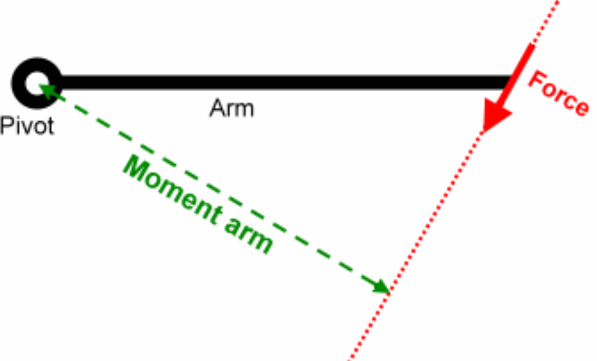

Tags: #Topic 

# Torque

**Torque** ($\tau$ : Vector | $N \cdot m$) - Torque is the rotational equivalent of [[Force]], and measures a push or pull that rotates an object.

Like force, it has a similar equation,

$$\Huge \tau = I \alpha$$

> **LEGEND:**
> $\tau$ - Torque acting on the object.
> $I$ - Moment of inertia of the object.
> $\alpha$ - Angular acceleration on the object from the torque.

#### [[Moment of Inertia]]

## Force to Torque

Torque is related to force by

$$\Huge \tau = F \times L$$

> **LEGEND:**
> $\tau$ - Torque exerted by the force.
> $F$ - Force that exerts a torque.
> $L$ - Length of a vector starting from the pivot point and ending at the origin of the force.

Another way to think about this is with the force in relation to the lever arm, which is an imaginary line that is found by extending the lengths of the force on both sides and then drawing a line from the pivot point to the closest point on the line.

The lever arm is also sometimes  calls the **"moment arm."**

The torque that the force currently creates is equivalent to the torque it would create if it were moved to the end of the lever arm.

$$\Huge \tau = F L_a$$

> **LEGEND:**
> $\tau$ - Torque exerted by the force.
> $F$ - Force that exerts a torque.
> $L_a$ - The moment arm.